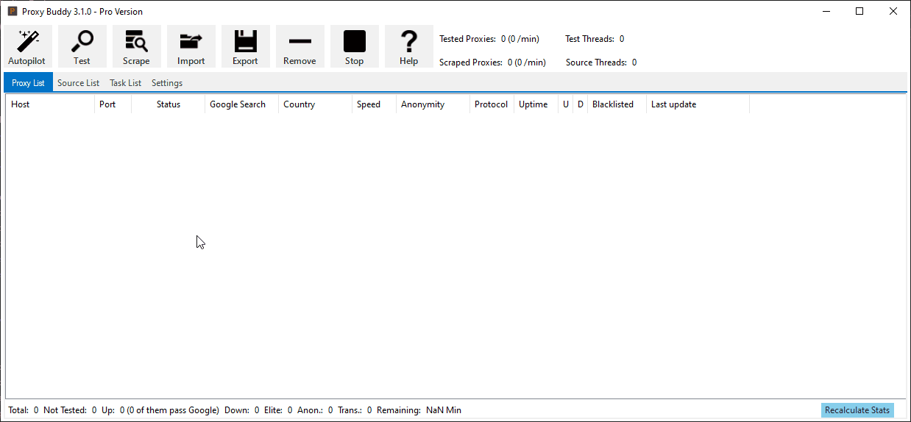

# 📖 Software Guide

## Quick Start

### Autopilot

The **Autopilot** feature will scrape all proxy sources and test the found proxies afterwards. Proxy Sources will be downloaded from GSL if they are missing. Working proxy server will be added to the Proxy List.

1. **Press on the Autopilot button** to automatically download a list of proxy source from GSL. Those source will automatically be scraped and the found proxy servers tested. Those proxy servers that are determined as working will be added to the _Proxy List_.

#### **Alternative**

1. **Import** Proxy Sources (URLs) from file or clipboard to scrape proxies by clicking on the **Import** button.
2. **Scrape** the imported sources for proxies by clicking on the **Scrape** button (**Note:** Scraped proxies wont be tested automatically.).
3. **Test** the scraped proxies by clicking on the **Test** button.
4. **Export** the working proxies according to your needs by using the **Export** button.

### Top Menu

#### **Autopilot**

The **Autopilot** will scrape proxy source and test the found proxies afterwards. Proxy Sources will be downloaded from GSL if there are no proxy source inside the list. Working proxy server will be added to the _Proxy List_.

#### **Test**

The **Test** feature allows to manually test proxy servers.

#### **Scrape**

The **Scrape** feature allows to manually scrape proxy source from the _Source List_ Proxy Source can also be downloaded the the GSL servers.

#### **Import**

The **Import** feature allows to manually import proxy servers or proxy source from either file or clipboard (_STRG+C_).

#### **Export**

The **Export** feature allows to manually export proxy servers or proxy source from either file or clipboard (_STRG+V_).

#### **Remove**

The **Remove** feature allows to manually remove proxy servers or proxy source from the lists.

#### **Stop**

The **Stop** button will stop all current operations. It can take some minutes until all threads are shutdown.

#### **Help**

The **Help** button opens the help page with the software manual in the systems' default browser.

## Proxy Tester

**Proxy Buddy** is the fastest proxy tester on the market for Windows desktop or server systems. With socket-based multi-threading support, it can test more than 10.000 proxies every minute. It tests proxies for Google Pass (Google Search) and determines the country, speed, anonymity level, SSL support, and the used protocol (e.g. HTTP, HTTPS, SOCK4, SOCKS5). The proxy servers' IP address will be checked for blacklisting in the _stopforumspam_ database as well.

## Proxy List

#### Proxy List Description

| Function      | Description                                                               |
| ------------- | ------------------------------------------------------------------------- |
| Host          | IP address of the proxy server.                                           |
| Port          | Port of the proxy server.                                                 |
| Status        | Status of the proxy server (Up, Down, NotTested)                          |
| Google Search | Result of the google search test (GooglePassed, GoogleBlocked, NotTested) |
| Country       | Origin country of the proxy server.                                       |
| Speed         | Time needed for a basic request (lower is better).                        |
| Anonymity     | Anonymity level of the proxy server (Transparent, Anonymous, Elite)       |
| Protocol      | Connection protocol of the proxy server (HTTP, HTTPS, Socks4, Socks5)     |
| Uptime        | Uptime in percent (0-100)                                                 |
| U             | Uptime counter (Note: Will be increased with every successful test)       |
| D             | Down counter (Note: Will be increased with every unsuccessful test)       |
| Blacklisted   | Displays if the proxy servers' IP address is blacklisted.                 |
| Last update   | Last time the proxy was updated (e.g. added, tested).                     |

### Context Menu

#### Context Menu Description

| Function       | Description                                                                                            |
| -------------- | ------------------------------------------------------------------------------------------------------ |
| Tick (_Check_) | Tick the checkbox of proxy servers (Note: This is used to test, export, remove checked proxy servers). |
| Copy           | Copy proxy servers to the clipboard in IP:Port format.                                                 |

#### Status Bar Description

| Function   | Description                                                                                                    |
| ---------- | -------------------------------------------------------------------------------------------------------------- |
| Total      | Displays the total amount of proxy servers inside the list.                                                    |
| Not Tested | Displays the amount of untested proxy servers.                                                                 |
| Up         | Displays the amount of up/online proxy servers (The amount of proxy servers that pass the Google Search test). |
| Down       | Displays the amount of down/offline proxy servers.                                                             |
| Elite      | Displays the amount of proxy servers with an anonymity level of _Elite_.                                       |
| Anon.      | Displays the amount of proxy servers with an anonymity level of _Anonymous_.                                   |
| Trans.     | Displays the amount of proxy servers with an anonymity level of _Transparent_.                                 |
| Remaining  | Displays the remaining time in minutes to finish the testing process.                                          |

## Proxy Scraper

Proxy Buddy is the best proxy scraper software. It comes with a built-in list of fresh proxy sources. These allow to easily scrape huge lists of Google proxies each and every day. Found proxy lists can be used with all popular SEO software, SEO tools, and bots, including but not limited to GSA Search Engine Ranker, SENuke, Scrapebox.

### Source List

| Function      | Description                                           |
| ------------- | ----------------------------------------------------- |
| Status        | The status of the source (Scraped, NotScraped, Down). |
| URL           | The URL of the proxy source.                          |
| Proxies found | Displays the amount of found proxies.                 |
| Quality       | The calculated quality.                               |
| Last update   | The last time the source was updated.                 |

### Context Menu

#### Context Menu Description

| Function          | Description                                                                                               |
| ----------------- | --------------------------------------------------------------------------------------------------------- |
| Tick All          | Enables/Checks the checkbox of all sources.                                                               |
| Tick None         | Disables/Unchecks the checkbox of all sources.                                                            |
| Calculate Quality | Calculate the quality of the sources according to the tested proxies (from 0 (worse) to 100 (very good)). |

#### Status Bar

The status bar at the bottom of the source list shows the amount of proxy sources inside the list.

## Task Scheduler

Proxy Buddy comes with the ability to use advanced scheduling (task-management) features to automate nearly every feature. Tasks only have to be setup once and they will run by themselves after the defined time. Tasks can be created for proxy scraping, testing, filtering, exporting, or sending lists of proxies by email.

#### Task List Description

| Function               | Description                                                                                                         |
| ---------------------- | ------------------------------------------------------------------------------------------------------------------- |
| ID                     | Identifier of the task.                                                                                             |
| Name                   | Name of the task.                                                                                                   |
| Action                 | Action that will be executed by the task.                                                                           |
| Next execution in Min  | The time in minutes when the task will be scheduled for execution the next time.                                    |
| Execution every in Min | The delay between task executions.                                                                                  |
| Last Execution         | The time when the task was executed the last time.                                                                  |
| Sub-Task               | The Identifier (ID) of the task that will be executed right after the parent (this) task was successfully executed. |

#### Status Bar Description

| Function             | Description                                            |
| -------------------- | ------------------------------------------------------ |
| Add new Task         | Add a new task (Note: See below for more information). |
| Edit selected Task   | Edit the selected (blue background) task.              |
| Remove selected Task | Remove the selected (blue background) task.            |
| Start selected Task  | Manually start the selected (blue background) task.    |

### Add/Edit Task

#### Task Action

The action defines the functionality of the task that should be executed.

| Function                                     | Description                                                              |
| -------------------------------------------- | ------------------------------------------------------------------------ |
| Test Proxies matching Filter                 | Test all proxies matching the filter.                                    |
| Export Proxies matching Filter               | Export all proxies matching the filter.                                  |
| Remove Proxies matching Filter               | Remove all proxies matching the filter.                                  |
| Upload Proxies to FTP server matching Filter | Upload all proxies matching the filter to the configured FTP server.     |
| Send Proxies by Mail matching Filter         | Send all proxies matching the filter to the configured E-Mail addresses. |
| Scrape All Proxy Source                      | Scrape all proxy source.                                                 |
| Download new Proxy Source from GSoftwareLab  | Download new proxy source from GSoftwareLab.                             |

#### Task Scheduling

| Function                      | Description                                                                                       |
| ----------------------------- | ------------------------------------------------------------------------------------------------- |
| Execute Task every x minutes. | The delay between task executions (e.g. 60 minutes: The Task will be executed every 60 minutes.). |

#### Assign Sub-Task

Sub-Tasks will be executed right after the parent (this) task has been completed. The Sub-Task needs to exists before it can be added. To add a Sub-Task afterward you can use the _Edit selected Task_ feature.

| Function                       | Description                                                               |
| ------------------------------ | ------------------------------------------------------------------------- |
| Assign a Sub-Task to this Task | Select a task (ID) that should be assigned as Sub-Task (Note: see above). |

#### Task Name

| Function  | Description                                        |
| --------- | -------------------------------------------------- |
| Task Name | Give the task a name that you can easily remember. |

#### Export Settings

| Function                                                 | Description                                                                                    |
| -------------------------------------------------------- | ---------------------------------------------------------------------------------------------- |
| Export in Scrapebox/Traffic Buddy format                 | Export proxy servers in the format used by Scrapebox and Traffic Buddy.                        |
| Path                                                     | Browse the filepath where the exported proxies should be saved.                                |
| Dynamic Filename (Current time appended to the filename) | By adding the current time stamp to the filename previously created files wont be overwritten. |

### Filter

Filters are used to filter out proxy servers that should not be included in the action (e.g. To only export working (UP) proxy servers to a file the filter preset _UP_ should be used). If a proxy server should be included in the action the specific checkbox of filter should be checked (e.g. include all online proxies - check the _UP_ checkbox). 

#### Proxy Status

| Function   | Description                              |
| ---------- | ---------------------------------------- |
| UP         | Filter for online (UP) proxy servers.    |
| Down       | Filter for offline (Down) proxy servers. |
| Not Tested | Filter for untested proxy servers.       |

#### Proxy Uptime

| Function     | Description                                                                       |
| ------------ | --------------------------------------------------------------------------------- |
| Uptime over  | Filter for proxy servers with an uptime score over n % (Note: higher is better).  |
| Uptime under | Filter for proxy servers with an uptime score under n % (Note: higher is better). |

#### Proxy Protocol

| Function    | Description                                                   |
| ----------- | ------------------------------------------------------------- |
| HTTP        | Filter proxy servers with the HTTP protocol.                  |
| HTTPS (SSL) | Filter proxy servers with the HTTPS protocol, supporting SSL. |
| Socks 4     | Filter proxy servers with the Socks 4 protocol.               |
| Socks 5     | Filter proxy servers with the Socks 5 protocol.               |

#### Proxy Google Search Pass

| Function       | Description                                                   |
| -------------- | ------------------------------------------------------------- |
| Google Passed  | Filter proxy servers that pass the Google Search Test.        |
| Google Blocked | Filter proxy servers that do not pass the Google Search Test. |
| Not Tested     | Filter proxy servers that are untested for Google Pass.       |

#### Proxy Blacklisted

| Function        | Description                                                                    |
| --------------- | ------------------------------------------------------------------------------ |
| Blacklisted     | Filter proxy servers that are blacklisted by the _stopforumspam_ database.     |
| Not Blacklisted | Filter proxy servers that are not blacklisted by the _stopforumspam_ database. |
| Not Tested      | Filter for untested proxy servers.                                             |

#### Proxy Speed

| Function    | Description                                                                                |
| ----------- | ------------------------------------------------------------------------------------------ |
| Speed over  | Filter for proxy servers with an connection speed over n seconds (Note: lower is better).  |
| Speed under | Filter for proxy servers with an connection speed under n seconds (Note: lower is better). |

#### Proxy Anonymity Level

| Function                                                                                               | Description                                                           |
| ------------------------------------------------------------------------------------------------------ | --------------------------------------------------------------------- |
| Transparent L3                                                                                         | Filter proxy servers that are Transparent L3 (bad).                   |
| Anonymous L2                                                                                           | Filter proxy servers that are Anonymous L2 (good).                    |
| Elite L1                                                                                               | Filter proxy servers that are Elite L1 (very good).                   |
| Exact level                                                                                            | Use the exact anonymity level of the proxy server.                    |
| Exact level or higher                                                                                  | Use the exact or higher (better) anonymity level of the proxy server. |
| ### Proxy Country                                                                                      |                                                                       |
| Filter country that should be included (e.g. Check Germany to include all proxy servers from Germany). |                                                                       |

#### Filter Presets

| Function              | Description                                               |
| --------------------- | --------------------------------------------------------- |
| Filter: Google Passed | Configure the filter to only match Google Passed proxies. |
| Filter: UP            | Configure the filter to only match up/online proxies.     |
| Filter: RESET         | Reset all configured filters.                             |

## Settings

On the **Settings** tab, several software parameters can be adjusted. The settings tab can be found in the top menu.

### General Settings

#### Thread Settings

| Function               | Description                                                                     |
| ---------------------- | ------------------------------------------------------------------------------- |
| Maximum Test-Threads   | Set the maximum amount of threads used to test proxies.                         |
| Maximum Scrape-Threads | Set the maximum amount of threads used to scrape proxies from the proxy source. |
| Timeout in seconds     | Set the timeout in seconds.                                                     |

#### General Settings

| Function               | Description                                                                |
| ---------------------- | -------------------------------------------------------------------------- |
| Start with Windows     | Start Proxy Buddy with Windows.                                            |
| Enable GridLines       | Enable grid lines on all lists (Proxy, Source and Task list).              |
| Enable Full-Row-Select | Enable full-row-select on all lists.                                       |
| Visual Theme           | Select a theme to change the visual presence.                              |
| Enable Debug Mode      | Enables the debug mode that writes additional information to the log-file. |
| Reduce CPU usage       | Reduce CPU usage by disabling visual features.                             |

#### Save Settings

| Function                              | Description                                                          |
| ------------------------------------- | -------------------------------------------------------------------- |
| Save Settings on exit                 | Save the settings when the program shuts down.                       |
| Save Proxy List on exit               | Save the proxy list when the program shuts down.                     |
| Save Source List on exit              | Save the source list when the program shuts down.                    |
| Automatically create database backups | Automatically create backup files of the proxy and s ource database. |
| Create Backup now                     | Create a backup of the proxy and source database now.                |

#### License Settings

| Function       | Description                                            |
| -------------- | ------------------------------------------------------ |
| License Key    | Displays the activated license key.                    |
| License Type   | Display the license type of the activated license key. |
| Remove License | Remove the activated license from the software.        |

#### Test Settings

#### Google Settings

| Function                    | Description                                       |
| --------------------------- | ------------------------------------------------- |
| Test for Google search pass | Test if a proxy can search/scrape google.         |
| Google Search Test URL      | Set the URL that is used to test the google pass. |

#### General Test Settings

| Function               | Description                                                                          |
| ---------------------- | ------------------------------------------------------------------------------------ |
| Test server location   | Determine the country of the proxy server while testing.                             |
| Test Anonymity         | Determine the anonymity level while testing (Transparent, Anonymous, Elite).         |
| Use public proxy judge | Use custom/public proxy judges for determining the anonymity level of proxy servers. |
| Test HTTP protocol     | Test if the proxy supports the HTTP protocol.                                        |
| Test HTTPS support     | Test if the proxy supports the HTTPS/SSL.                                            |
| Test Socks4 protocol   | Test if the proxy supports the Socks4 protocol.                                      |
| Test Socks5 protocol   | Test if the proxy supports the Socks5 protocol.                                      |

#### Test and Scrape (Auto) Settings

| Function                                                  | Description                                                    |
| --------------------------------------------------------- | -------------------------------------------------------------- |
| Stop Test and Scrape (Auto) when found x working proxies. | Stop the autopilot when x amount of working proxies was found. |
| Only add up/online proxies to the Proxy List.             | Only add proxies that are up/online to the proxy list.         |

#### Duplicate Settings

| Function                             | Description                                                                |
| ------------------------------------ | -------------------------------------------------------------------------- |
| Automatically remove duplicates      | Automatically remove duplicate proxies when importing or scraping proxies. |
| Automatically remove invalid proxies | Automatically remove invalid proxies from the proxy list while testing.    |

### E-Mail Settings

#### E-Mail Settings

| Function                                               | Description                                                                                                    |
| ------------------------------------------------------ | -------------------------------------------------------------------------------------------------------------- |
| SMTP Server                                            | The SMTP server of your E-Mail provider.                                                                       |
| SMTP Port                                              | The SMTP port of your E-Mail provider.                                                                         |
| SMTP Username                                          | The SMTP username of your E-Mail, usually the E-Mail address.                                                  |
| SMTP Password                                          | The SMTP username of your E-Mail, usually the E-Mail password.                                                 |
| E-Mail From                                            | Define the origin E-Mail, usually your E-Mail address.                                                         |
| Subject                                                | Define the E-Mail subject.                                                                                     |
| Body                                                   | Define the E-Mail body (text).                                                                                 |
| Enable SSL                                             | Enable or disable SSL (depends on your E-Mail provider).                                                       |
| Maximum amount of proxies sent                         | Limit the number of sent proxies.                                                                              |
| Attach proxies as text file (else append them to body) | Attach the proxies as a text file to the E-Mail or append them to the E-Mails' body as text in IP:Port format. |

#### E-Mail Receiver List

| Function               | Description                                                    |
| ---------------------- | -------------------------------------------------------------- |
| Manually Send E-Mails  | Manually send E-Mail with proxies to the E-Mails listed below. |
| Add E-Mail             | Add an E-Mail to the E-Mail list.                              |
| Email                  | The E-Mail that should be added to the list.                   |
| Remove selected E-Mail | Remove the selected E-Mail from the list.                      |

### Upload Settings

| Function                  | Description                                                      |
| ------------------------- | ---------------------------------------------------------------- |
| FTP Server                | FTP Server                                                       |
| FTP Path + Filename       | todo                                                             |
| FTP Username              | FTP Username                                                     |
| FTP Password              | FTP Password                                                     |
| Limit uploaded proxies to | Limit the number of uploaded proxies.                            |
| Manually Upload           | Press this button to manually upload a proxy list to the server. |

### Error Log

| Function               | Description                      |
| ---------------------- | -------------------------------- |
| Refresh Logfile        | Read the logfile and display it. |
| Clear Logs and Logfile | Clears the logfile.              |
