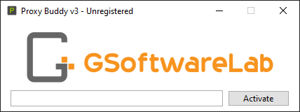

# Proxy Buddy

Software Documentation for [Proxy Buddy](https://gsoftwarelab.com/proxy-buddy-scraper-tester/) Version 3.1.0 - Last Update: 2022/05/02

## Getting Started

Proxy Buddy is an award-winning proxy scanner and tester that makes it easy to scrape, test, filter, and export thousands of public proxy servers to meet your specific needs. With the new one-click autopilot feature, you can quickly and easily harvest and test thousands of proxies with just a single click. You can then export these proxy lists to use with a wide range of SEO software and bots. Additionally, a special Google search test allows you to verify if the proxy servers can successfully scrape search engine results from Google.

## Purchase

Proxy Buddy can be purchased on our [online shop](https://gsoftwarelab.com/shop/). Orders will be processed instantly, the license key and download link will be shipped by email. For pre-sales questions kindly [contact us](https://gsoftwarelab.com/contact-us/).

## Installation

To download Proxy Buddy use the link in your order confirmation or use the download button in your [customer area](https://gsoftwarelab.com/my-account/downloads/). Proxy Buddy **requires .Net 6.0.1** or later. The .Net 6.0.X installer can be downloaded from [Microsoft](https://dotnet.microsoft.com/en-us/download/dotnet/6.0).

## Activation

The license key is shipped with your order confirmation email. It has to be entered on the first application start. It is recommended to write your license key down or to print out the order confirmation email.

To prevent typos consider copy and pasting the license key form the order confirmation email. After pasting it make sure there is no white space (" ") in the beginning or at the end of your entered license key. If you have problems activating your product please feel free to contact our support team.

## Trouble Shooting / FAQ

**Q:** Do you provide a free trial version? \
**A:** We offer a 7-day money-back guarantee on any purchase a free trial is currently not planned.

**Q:** I have problems starting the program. \
**A:** Please check if you have .Net 6.0.1 or later installed on your computer or download it from [Microsoft](https://dotnet.microsoft.com/en-us/download/dotnet/6.0).

**Q:** The program shows that my license key is invalid. \
**A:** Please check your internet connection and make sure that there is no white space (" ") in the beginning or at the end of your entered/copied license key.
