## Quick Start

1. Press on *Autopilot* to automatically download a list of proxy source from our servers, scrape proxies and test them. Those proxy servers that are determined as working will be added to the *Proxy List*.

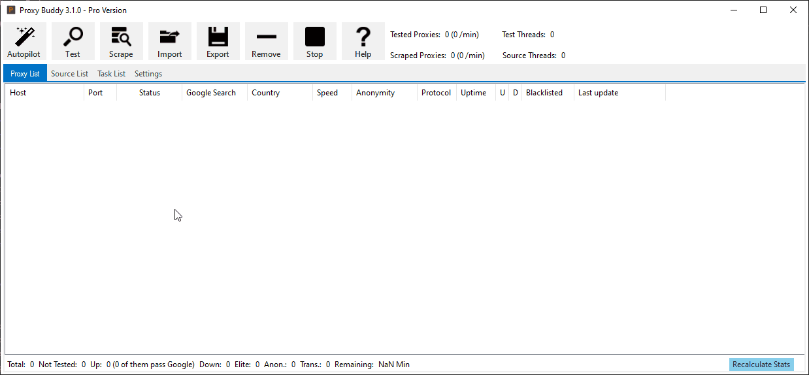

**OR**

1. *Import* Proxy Sources to scrape proxies from.
2. *Scrape* the imported sources for proxies.
3. *Test* the scraped proxies.
4. *Export* the working proxies according to your needs.

## Autopilot

The *Autopilot* will scrape all proxy sources and test the found proxies afterward. Proxy Sources will be downloaded from GSL if there is no proxy source inside the list. Working proxy server will be added to the *Proxy List*.

## Proxy Tester

Proxy Buddy is the fastest proxy tester on the market for Windows Desktop. With socket-based multi-threading support, it can test more than 10.000 proxies every minute. It tests proxies for Google Pass (Google Search) and determines the country, speed, anonymity, SSL support, and the used protocol (HTTP, HTTPS, SOCK4, SOCKS5). The proxy servers' IP address will be checked for blacklisting in the stopforumspam database as well.

### Proxy List

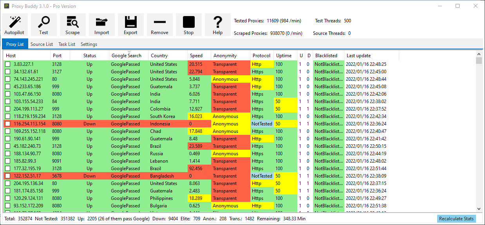

|Function | Description
--- | ---
|Host| IP address of the proxy server.
|Port| Port of the proxy server.
|Status| Status of the proxy server (Up, Down, NotTested)
|Google Search| 
|Country| Origin country of the proxy server.
|Speed| Time needed for a basic request (lower is better).
|Anonymity| Anonymity level of the proxy server (Transparent, Anonymous, Elite)
|Protocol| Connection protocol of the proxy server (HTTP, HTTPS, Socks4, Socks5)
|Uptime| Uptime in percent (0-100)
|U| Uptime counter
|D| Down counter
|Blacklisted| Displays if the proxy server (IP) is blacklisted.
|Last update| Last time the proxy was updated/tested.

### Context Menu

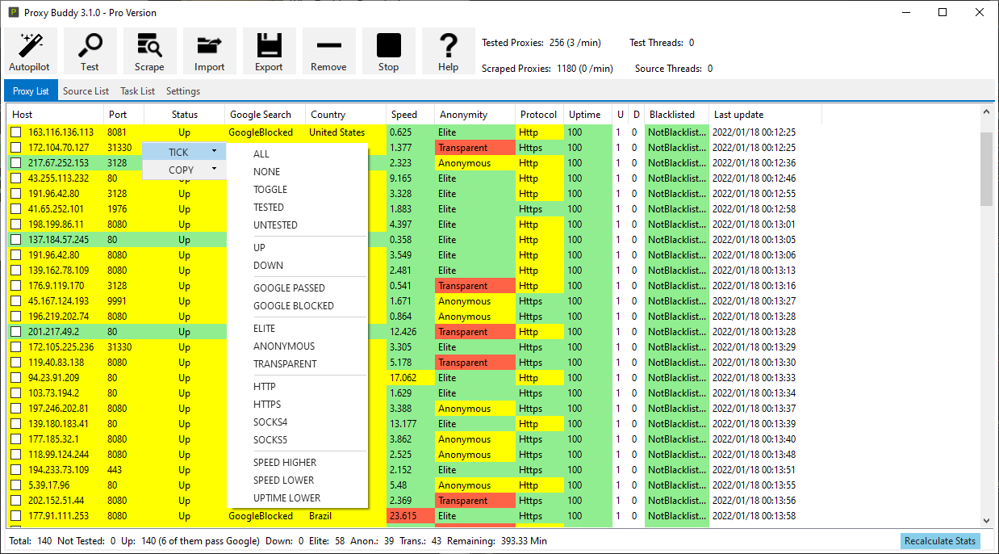

|Function | Description
--- | ---
|Tick| Tick the checkbox of proxy servers.
|Copy| Copy proxy servers to the clipboard in IP:Port format.

### Status

## Proxy Scraper

Proxy Buddy is the best proxy scraper software. It comes with a built-in list of fresh proxy sources. These allow to easily scrape huge lists of Google proxies each and every day. Found proxy lists can be used with all popular SEO software, SEO tools, and bots, including but not limited to GSA Search Engine Ranker, SENuke, Scrapebox.

### Source List

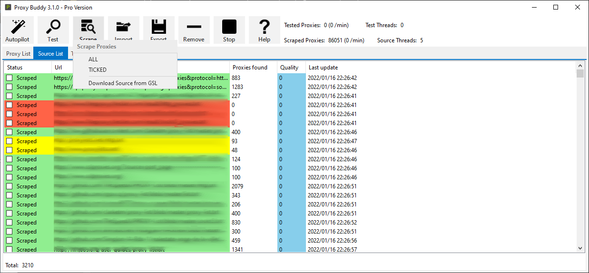

|Function | Description
--- | ---
|Status| The status of the source (Scraped, NotScraped, Down).
|URL| The URL of the proxy source.
|Proxies found| Displays the amount of found proxies.
|Quality| The calculated quality.
|Last update| The last time the source was updated.

### Context Menu

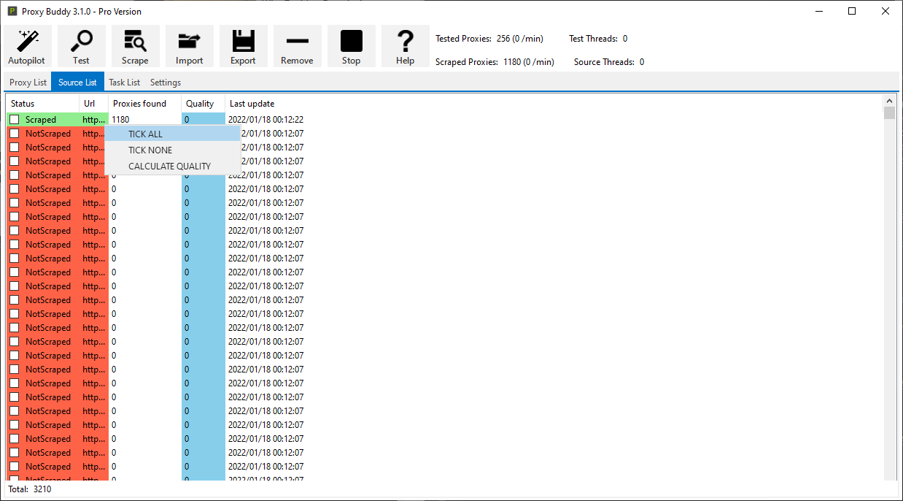

|Function | Description
--- | ---
|Tick All| Tick the checkbox of all sources.
|Tick None| Untick the checkbox of all sources.
|Calculate Qualits| Calculate the quality of the sources according to the tested proxies.

### Status
The status bar at the bottom of the source list shows the amount of proxy sources inside the list.

## Task Scheduler

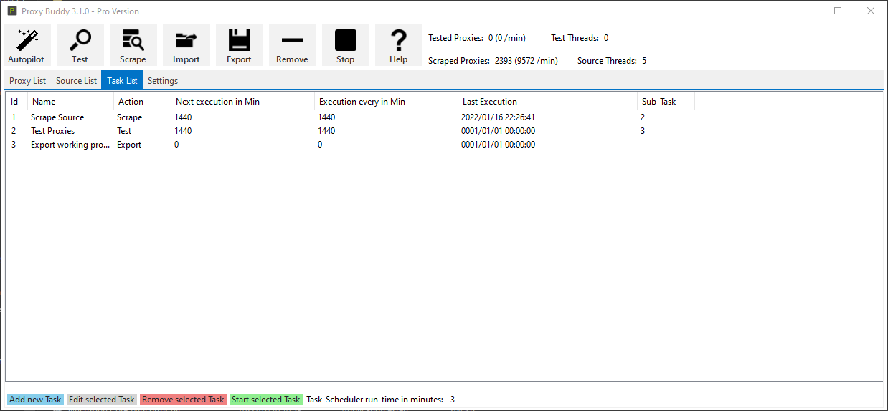

|Function | Description
--- | ---
|ID| ID of the task.
|Name| Name of the task.
|Action| Action that will be executed by the task.
|Next execution in Min| The time in minutes when the task will be scheduled for execution the next time.
|Execution every in Min| The delay between task executions.
|Last Execution| The time when the task was executed the last time.
|Sub-Task| The ID of the task that will be executed after the parent (this) task was executed.

### Action

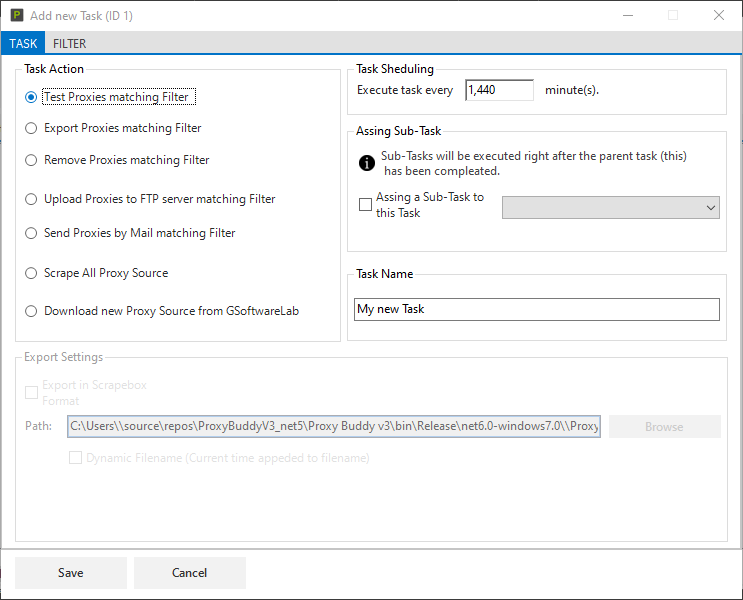

#### Task Action

|Function | Description
--- | ---
|Test Proxies matching Filter| Test all proxies matching the filter.
|Export Proxies matching Filter| Export all proxies matching the filter.
|Remove Proxies matching Filter| Remove all proxies matching the filter.
|Upload Proxies to FTP server matching Filter| Upload all proxies matching the filter to the configured FTP server.
|Send Proxies by Mail matching Filter| Send all proxies matching the filter to the configured E-Mail addresses.
|Scrape All Proxy Source| Scrape all proxy source.
|Download new Proxy Source from GSoftwareLab| Download new proxy source from GSoftwareLab.

#### Task Sheduling
|Function | Description
--- | ---
|Execute Task every x minutes.| The delay between task executions.

#### Assing Sub-Task
Sub-Tasks will be executed right after the parent (this) task has been completed.
|Function | Description
--- | ---
|Assign a Sub-Task to this Task| Select a task you have created before.

#### Task Name
|Function | Description
--- | ---
|Task Name| Give the task a name that you can easily remember.

#### Export Settings
|Function | Description
--- | ---
|Export in Scrapebox format| 
|Path| 
|Dynamic Filename (Current time appended to the filename)| 

### Filter

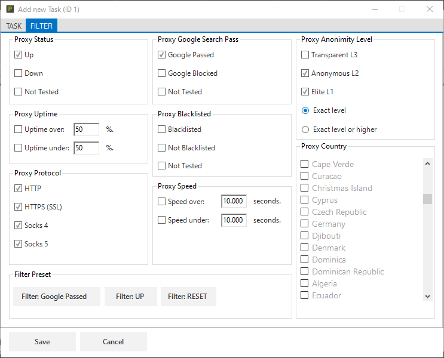

#### Proxy Status
|Function | Description
--- | ---

#### Proxy Uptime
|Function | Description
--- | ---

#### Proxy Protocol
|Function | Description
--- | ---

#### Filter Presets
|Function | Description
--- | ---
|Filter: Google Passed| Configure the filter to only match Google Passed proxies.
|Filter: UP| Configure the filter to only match up/online proxies.
|Filter: RESET| Reset all configured filters.

#### Proxy Google Search Pass
|Function | Description
--- | ---

#### Proxy Blacklisted
|Function | Description
--- | ---

#### Proxy Speed
|Function | Description
--- | ---

#### Proxy Anonimity Level
|Function | Description
--- | ---

#### Proxy Country
|Function | Description
--- | ---

## Top Menu

### Autopilot

The *Autopilot* will scrape proxy source and test the found proxies afterwards. Proxy Sources will be downloaded from GSL if there are no proxy source inside the list. Working proxy server will be added to the *Proxy List*.

### Test

### Scrape

### Import

### Export

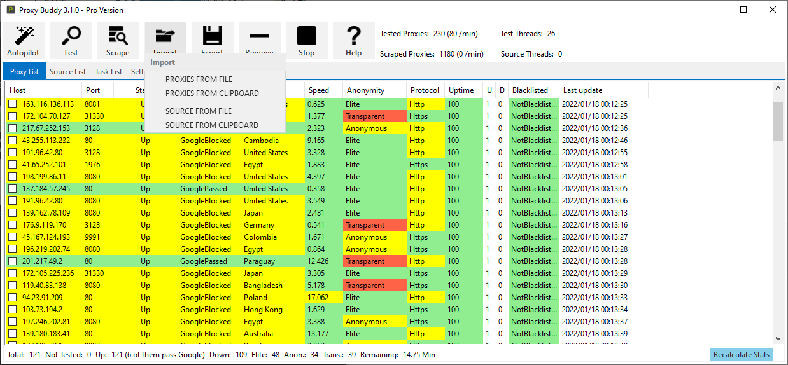

### Remove

### Stop
Stop all current operations. It can take some minutes until all threads are shutdown.

### Help
Opens the help page with the software manual in the default browser.

## Settings
On the *Settings* tab, several software parameters can be adjusted. The settings tab can be found in the top menu.

### General Settings

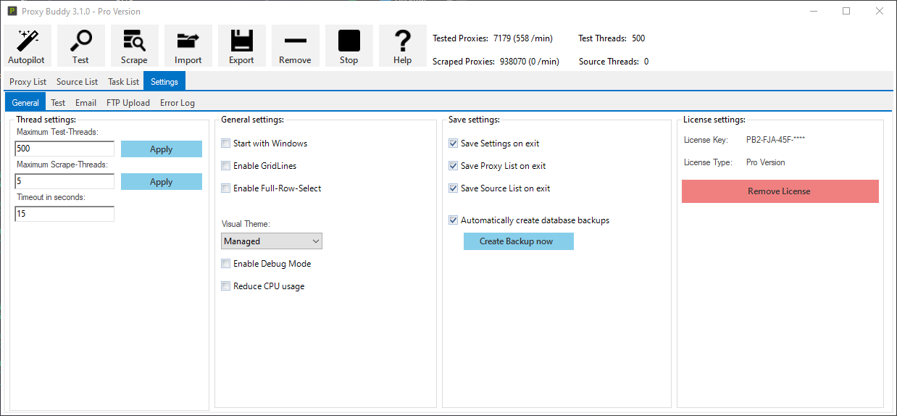

**Thread Settings**
|Function | Description
--- | ---
|Maximum Test-Threads| Set the maximum amount of threads used to test proxies.
|Maximum Scrape-Threads| Set the maximum amount of threads used to scrape proxies from the proxy source.
|Timeout in seconds| Set the timeout in seconds.

**General Settings**
|Function | Description
--- | ---
|Start with Windows| Start Proxy Buddy with Windows.
|Enable GridLines| Enable gridlines on all lists.
|Enable Full-Row-Select| Enable full-row-select on all lists.
|Visual Theme| Select a theme to change the visual presence.
|Enable Debug Mode| Enables the debug mode that writes additional information to the logfile.
|Reduce CPU usage| Reduce CPU usage by disabling visual features.

**Save Settings**
|Function | Description
--- | ---
|Save Settings on exit| Save the settings when the program shuts down.
|Save Proxy List on exit| Save the proxy list when the program shuts down.
|Save Source List on exit| Save the source list when the program shuts down.
|Automatically create database backups| Automatically create backup files of the proxy and source database.
|Create Backup now| Create a backup of the proxy and source database now.

**License Settings**
|Function | Description
--- | ---
|License Key| Displays the activated license key.
|License Type| Display the license type of the activated license key.
|Remove License| Remove the activated license from the software.

### Test Settings

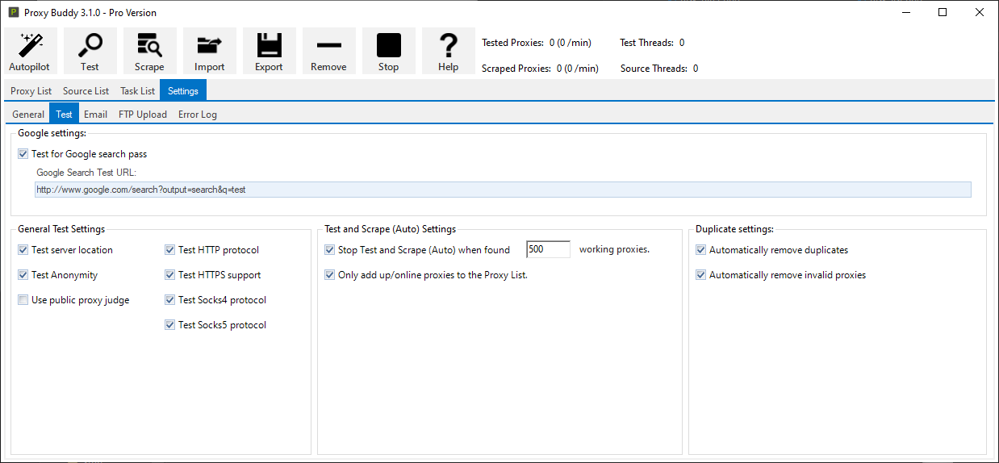

**Google Settings**
|Function | Description
--- | ---
|Test for Google search pass| Test if a proxy can search/scrape google.
|Google Search Test URL| Set the URL that is used to test the google pass. 

**General Test Settings**
|Function | Description
--- | ---
|Test server location| Determine the country of the proxy server while testing.
|Test Anonymity| Determine the anonymity level while testing (Transparent, Anonymous, Elite).
|Use public proxy judge| Use custom/public proxy judges for determining the anonymity level of proxy servers.
|Test HTTP protocol| Test if the proxy supports the HTTP protocol.
|Test HTTPS support| Test if the proxy supports the HTTPS/SSL.
|Test Socks4 protocol| Test if the proxy supports the Socks4 protocol.
|Test Socks5 protocol| Test if the proxy supports the Socks5 protocol.

**Test and Scrape (Auto) Settings**
|Function | Description
--- | ---
|Stop Test and Scrape (Auto) when found x working proxies.| Stop the autopilot when x amount of working proxies was found.
|Only add up/online proxies to the Proxy List.| Only add proxies that are up/online to the proxy list.

**Duplicate Settings**
|Function | Description
--- | ---
|Automatically remove duplicates| Automatically remove duplicate proxies when importing or scraping proxies.
|Automatically remove invalid proxies| Automatically remove invalid proxies from the proxy list while testing.

### E-Mail Settings

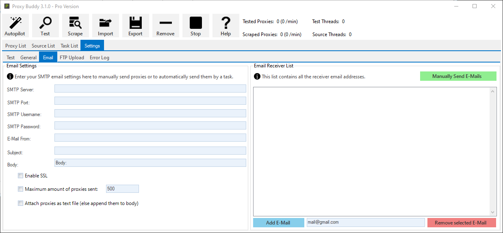

**E-Mail Settings**
|Function | Description
--- | ---
|SMTP Server| The SMTP server of your E-Mail provider.
|SMTP Port| The SMTP port of your E-Mail provider.
|SMTP Username| The SMTP username of your E-Mail, usually the E-Mail address.
|SMTP Password| The SMTP username of your E-Mail, usually the E-Mail password.
|E-Mail From| Define the origin E-Mail, usually your E-Mail address.
|Subject| Define the E-Mail subject.
|Body| Define the E-Mail body (text). 
|Enable SSL| Enable or disable SSL (depends on your E-Mail provider).
|Maximum amount of proxies sent| Limit the number of sent proxies.
|Attach proxies as text file (else append them to body)| Attach the proxies as a text file to the E-Mail or append them to the E-Mails' body as text in IP:Port format.

**E-Mail Receiver List**
|Function | Description
--- | ---
|Manually Send E-Mails| Manually send E-Mail with proxies to the E-Mails listed below. 
|Add E-Mail| Add an E-Mail to the E-Mail list.
|Email| The E-Mail that should be added to the list.
|Remove selected E-Mail| Remove the selected E-Mail from the list.

### Upload Settings

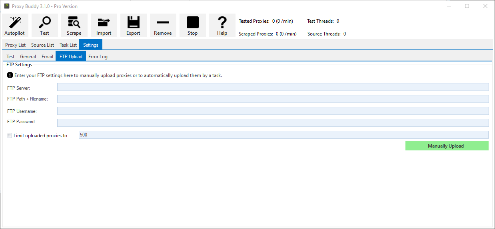

|Function | Description
--- | ---
|FTP Server| FTP Server
|FTP Path + Filename| 
|FTP Username| FTP Username
|FTP Password| FTP Password
|Limit uploaded proxies to| Limit the number of uploaded proxies.
|Manually Upload| Press this button to manually upload a proxy list to the server.

### Error Log

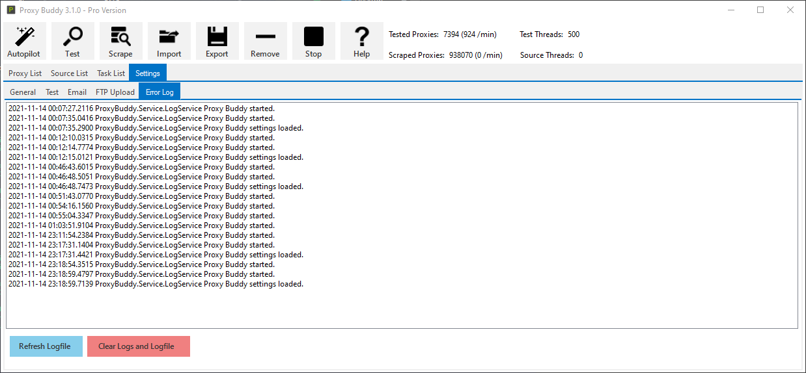

|Function | Description
--- | ---
|Refresh Logfile| Read the logfile and display it.
|Clear Logs and Logfile| Clears the logfile.