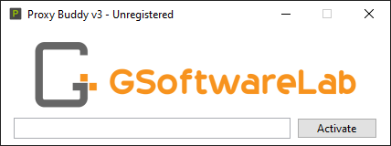

# Index Buddy v2

Software Documentation for [Index Buddy](https://gsoftwarelab.com/index-buddy-backlink-indexer/) Version 1.03 - Last Update: 2022/05/02

## Getting Started

Backlinks are a very important part for the ranking of websites in search engines. Many SEO experts use software tools, like Index Buddy, for fast backlink indexing. Index Buddy is a powerful & simple SEO indexing software, also called bulk indexer or website indexing software. It allows the indexing of domains, deep-links and backlinks into all major search engines like Google, Bing and Baidu. The indexing process only takes one hour most of the time.

Index Buddy automatically submits your URLs to thousands of whois, statistics, redirects which results in hundreds or even thousands of backlinks. So Google, Bing and Baidu will get noticed about your URLs. The probability of indexing also highly depends on the quality of the pages’ content. The indexing process depends on secret algorithms used by search giants. To increase the probability of indexing a regular submission of your links and backlinks by Index Buddy will be recommended.

## Purchase

1. Go to our [online shop](https://gsoftwarelab.com/shop/) and add the product to your cart.
2. Check out and complete your purchase. Your order will be processed instantly.
3. Once your purchase is complete, you will receive an email with your license key and a download link.

Thank you for considering Proxy Buddy for your needs. We hope it helps you achieve your goals.

## Installation

To download Index Buddy use the link in your order confirmation or use the download button in your [customer area](https://gsoftwarelab.com/my-account/downloads/). Index Buddy v2 **requires .Net 6.0.1** or later. The .Net 6.0.X installer can be downloaded from [Microsoft](https://dotnet.microsoft.com/en-us/download/dotnet/6.0).

## Activation

The license key is shipped with your order confirmation email. It has to be entered on the first application start. It is recommended to write your license key down or to print out the order confirmation email.

To prevent typos consider copy and pasting the license key form the order confirmation email. After pasting it make sure there is no white space (" ") in the beginning or at the end of your entered license key. If you have problems activating your product please feel free to contact our support team.

Remember to keep your license key safe, as it will be needed for future activation or updates. If you'd like, you can write it down or print out the order confirmation email for easy reference. Thank you for choosing our product, and we hope it helps you achieve your goals.

## Trouble Shooting / FAQ

**Q:** Is there a way to try your product before committing to a purchase? \
**A:** We offer a 14-day money-back guarantee on all purchases, so you can feel confident in trying out our product. However, we do not currently have a free trial version available. If you have any further questions or concerns about the product, please don't hesitate to reach out to us. We're always happy to help.

**Q:** I'm having trouble starting the program. What should I do?\
**A:** There could be a few different things that could be causing issues with starting the program. Here are a few things you can try:

1. Make sure you have the latest version of .NET (6.0.1 or later) installed on your computer. You can download the latest version from the [Microsoft](https://dotnet.microsoft.com/en-us/download/dotnet/6.0) website.
2. Check to see if there are any updates available for the program. Sometimes issues can be resolved by simply updating to the latest version.
3. Try restarting your computer and then attempting to start the program again.
4. If you're still having issues, try uninstalling and reinstalling the program.

If you've tried all of these steps and are still having problems starting the program, please don't hesitate to reach out to our support team for further assistance.

**Q:** I'm getting an error that my license key is invalid. What could be causing this issue? \
**A:** There are a few potential causes for this issue:

1. Check your internet connection to ensure that you have a stable connection. This is necessary for the program to verify your license key.
2. Make sure that there are no extra spaces before or after the license key. Sometimes when copying and pasting, these spaces can be inadvertently added and can cause the key to be invalid.
3. Check to make sure that you are entering the correct license key. If you have multiple keys or are unsure which key to use, it might be helpful to double-check with whoever provided the key or with our support team.

If you've tried all of these steps and are still having issues with your license key, please don't hesitate to reach out to our support team for further assistance.
