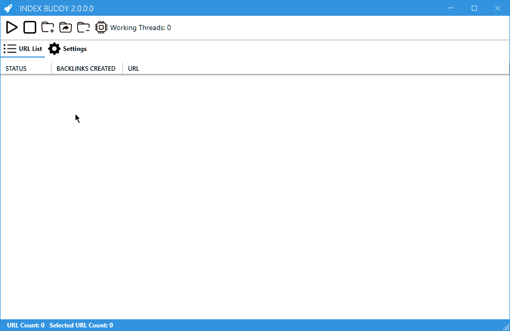

# 📖 Software Guide

Welcome to the Index Buddy V2 Quick Start Guide! This guide will help you effortlessly navigate through the software and its advanced indexing capabilities. Boost your website's visibility and ranking on major search engines like Google, Bing, and Baidu with just a few simple steps. Follow the instructions below to index single URLs, entire websites, or bulk lists of URLs.

### Quick Start Guide

<figure><figcaption>
Add URLs and start the Indexing Process
</figcaption></figure>

1. **Import URLs for Indexing**

* Begin by importing the URLs you wish to index. This can be a single URL, an entire website, or a bulk list of URLs.

2. **Customize Settings**

* Fine-tune the software settings to align with your specific needs and preferences. Adjust options such as amount of backlinks or number of threads to use.

3. **Initiate the Indexing Process**

* Once your URLs and settings are in place, start the indexing process with a single click. Index Buddy V2 will now work its magic to improve the visibility and ranking of your website or URLs.

4. **Export Backlinks**

* After the indexing process is complete, export the resulting backlinks for further analysis, tracking, or reporting.

With this quick and easy guide, you'll be able to harness the power of Index Buddy V2 to enhance your website's search engine visibility. Happy indexing!

### Importing URLs

<figure><figcaption></figcaption></figure>

To begin indexing URLs with Index Buddy, you need to first import them. URLs can be imported from the clipboard or a text file by clicking the _Import_ tab. Follow the steps below for each import method:

| Function                   | Description                                                          |
| -------------------------- | -------------------------------------------------------------------- |
| Import URLs from File      | Import URLs to be indexed from a text file, with one URL per line.   |
| Import URLs from Clipboard | Import URLs from the clipboard (copied URLs), with one URL per line. |

### Customizing Settings

<figure><figcaption>
Settings
</figcaption></figure>

You can adjust various software parameters in the _Settings_ tab, located in the top menu on the left side. To apply any changes, click the _Apply Changes_ button in the bottom right corner.

<table><thead><tr><th>Setting</th><th width="89.33333333333331">Default</th><th>Description</th></tr></thead><tbody><tr><td>Maximum Threads</td><td>50</td><td>Set the maximum number of working threads. Increasing the thread count may improve speed but will require more system resources.</td></tr><tr><td>Timeout in ms</td><td>10</td><td>Define the time (in seconds) to wait before canceling a single request. If you have a slow internet connection, consider increasing the timeout to 10s.</td></tr><tr><td>Limit Backlinks per URL</td><td>500</td><td>Set the maximum number of backlinks to create per URL for indexing.</td></tr><tr><td>Enable Dark Mode</td><td>Off</td><td>Set if the dark mode should be enabled or disabled.</td></tr><tr><td>Apply Changes</td><td></td><td>Use this button to save changes that were made to the settings. The settings will then be applied on the next indexing process.</td></tr><tr><td>Deactivate License</td><td></td><td>Use this option to enter a new license key and remove the current one from the computer.</td></tr></tbody></table>

### Initiating the Indexing Process

<figure><figcaption>
Indexing Process
</figcaption></figure>

Start the indexing process by clicking the _Index_ button in the top menu. The _Backlinks Sent_ counter will increase once a backlink has been successfully created.

| Function             | Description                                                                   |
| -------------------- | ----------------------------------------------------------------------------- |
| Index all Links      | Begin the indexing process for all URLs in the _Index List_.                  |
| Index selected Links | Initiate the indexing process only for the selected URLs in the _Index List_. |

| Function             | Description                                                                     |
| -------------------- | ------------------------------------------------------------------------------- |
| Index all Links      | The indexing process for all URLs inside the _Index List_ will be started.      |
| Index selected Links | The indexing process for selected URLs inside the _Index List_ will be started. |

### Exporting Results

<figure><figcaption>
Export Backlinks and URLs to Textfiles or as CSV List
</figcaption></figure>

Generate backlinks or Excel/CSV indexing reports by clicking the _Export_ button in the top menu.

| Function                      | Description                                                |
| ----------------------------- | ---------------------------------------------------------- |
| Export Backlinks as Text File | Export all created backlinks as a text file (.txt).        |
| Export Links as Text File     | Export all URLs in the _Index List_ as a text file (.txt). |
| Export Report as CSV          | Export an indexing report as a CSV/Excel sheet.            |
| Export Backlinks to Clipboard | Copy all created backlinks to the clipboard.               |
| Export Links to Clipboard     | Copy all URLs in the _Index List_ to the clipboard.        |

**Excel/CSV Export Options**

When exporting Excel reports, choose the standard format by clicking _YES_ for the US format or _NO_ for the EU format.

### Removing URLs

<figure><figcaption>
Remove URLs from the List
</figcaption></figure>

Remove URLs from the _Indexing List_ by clicking the _Remove_ button in the top menu.

| Function              | Description                                          |
| --------------------- | ---------------------------------------------------- |
| Remove all Links      | Delete all URLs from the _Index List_.               |
| Remove Selected Links | Remove only the selected URLs from the _Index List_. |
