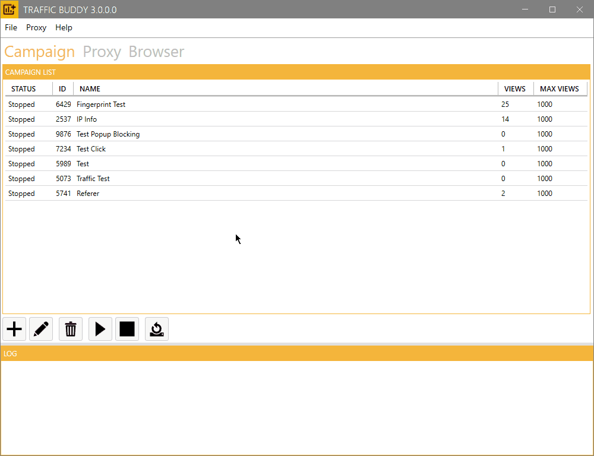
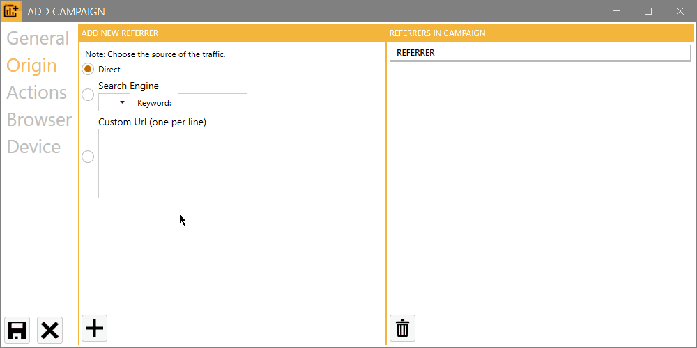

# Campaigns

<figure><figcaption></figcaption></figure>

In the **Campaign** tab, you will find a comprehensive list of all your campaigns, allowing for easy navigation and management. At the bottom of this section, the current status of ongoing actions is displayed in real time, giving you instant feedback on your campaigns’ performance.

The following table provides a detailed description of each column within the campaign list, ensuring clarity and ease of use. Each column is designed to display crucial information regarding your campaigns, such as the campaign name, status, start and end dates, and active metrics. This organized layout allows you to quickly assess and manage your campaigns' vital statistics.

| Column Name | Description                                                                                                           |
| ----------- | --------------------------------------------------------------------------------------------------------------------- |
| Status      | The current status of the campaign. It can be Running, Stopping, Stopped or Paued.                                    |
| #B          | The number of currently running browser instances.                                                                    |
| ID          | The unique identifier of the campaign.                                                                                |
| Name        | The human readable name of the campaign.                                                                              |
| Views       | The current amount of views that were generated in the campaign.                                                      |
| #VT         | The number of generated views today.                                                                                  |
| #A          | The total number of executed actions.                                                                                 |
| #SA         | The total number of successfully executed actions.                                                                    |
| #FA         | The total number of failed actions.                                                                                   |
| Max Views   | The maximum number of views this campaign will generate. The campaign will stop when this threshold has been reached. |

Traffic Buddy features a **user-friendly interface** with intuitive buttons located below the campaign list. These buttons enable you to manage your campaigns efficiently, offering functionalities such as:

<table data-view="cards"><thead><tr><th>Button</th><th>Description</th></tr></thead><tbody><tr><td></td><td><strong>Start Campaign</strong>: Launch your campaigns with a single click.</td></tr><tr><td></td><td><strong>Stop Campaign</strong>: Pause campaigns whenever necessary.</td></tr><tr><td></td><td><strong>Add Campaign</strong>: Quickly create new campaigns tailored to your needs.</td></tr><tr><td></td><td><strong>Edit Campaign</strong>: Modify existing campaigns to optimize performance.</td></tr><tr><td></td><td><strong>Remove Campaign</strong>: Delete campaigns that are no longer needed.</td></tr><tr><td></td><td><strong>Reset View Count</strong>: Reset campaigns to view count.</td></tr></tbody></table>

## Add a new Campaign

Traffic Buddy allows you to create customized traffic campaigns to generate realistic visitor behavior for your website . Here's a detailed guide on how to set up a new campaign using the different configuration tabs.

<figure><figcaption>
Press the "+" button to add a new traffic campaign
</figcaption></figure>

### General Settings Tab

<figure><figcaption>
Add a new Campaign: General Settings
</figcaption></figure>

The General Settings tab contains the basic configuration options for your traffic campaign. Here you'll define the campaign's core parameters that determine its identity and scale.

**Campaign ID**

* An automatically generated unique identifier for your campaign
* Used for tracking and referencing your campaign within Traffic Buddy

**Campaign Name**

* Enter a descriptive name for your campaign
* This name helps you identify your campaign in the campaign list
* Example: "Summer Sale Landing Page Traffic" or "Product Page Testing"

**Maximum Concurrent Browsers**

* Defines how many browser instances can run simultaneously
* Each browser instance simulates one unique visitor
* Valid range: 1 to 1000 browsers
* Higher numbers generate more concurrent traffic but require more system resources
* Recommended: Start with a lower number and increase gradually based on your system's performance

📝 **Note:** Consider your system resources when setting concurrent browsers and maximum views. Higher numbers may require more powerful hardware.&#x20;

**Maximum Total Views**

* Sets the total number of page views the campaign will generate
* Campaign stops automatically when this number is reached
* Example: Setting this to 1000 means the campaign will stop after generating 1000 page views

**Maximum Views per Hour**

* Sets the total number of page views the campaign will generate per hour
* The campaign will be paused when this number has been reached
* The campaign will be started on the next hour

**Maximum Views per Day**

* Sets the total number of page views the campaign will generate per day
* The campaign will be paused when this number has been reached
* The campaign will be started on the next day

### Traffic Origin Tab

<figure><figcaption>
Traffic Origin Configuration - Define how visitors reach your website
</figcaption></figure>

The Traffic Origin Tab allows you to configure how visitors appear to arrive at your website. You can simulate different traffic sources that reflect realistic user behavior patterns.

You can configure multiple referrer sources that Traffic Buddy will cycle through during the campaign.

**1. Direct Traffic**

* Simulates visitors who type your URL directly into their browser
* No referrer information is sent
* Represents users who have bookmarked your site or received the link through messaging apps
* Toggle: Enable/Disable direct traffic

**2. Search Engine Traffic**

* Simulates visitors coming from search engine results
* Includes the search keyword in the referrer data
* Configuration fields:
  * Search Engine (e.g., Google, Bing)
  * Search Keyword(s)
* Example: A visitor searching "best running shoes" on Google

**3. Custom URL Referrers**

* Simulates visitors coming from specific websites
* Enter one URL per line
* Format: `https://www.example.com`
* Useful for simulating:
  * Social media traffic
  * Partner website referrals
  * Blog post references

**Managing Multiple Referrers**

* Add as many referrers as needed using the "Add Referrer" button
* Traffic Buddy will cycle through all enabled referrers sequentially
* Each new simulated visitor will use the next referrer in the cycle
* Use drag-and-drop to prioritize referrer order

📝 **Note:** At least one traffic source must be configured for the campaign to start.

⚠️ **Important:** Ensure your custom URLs are properly formatted and accessible to avoid campaign errors.&#x20;

💡 **Tip:** Mix different referrer types to create more realistic traffic patterns.

### Browser Actions Tab

<figure><figcaption>
Browser Actions Tab - Create your visitor's journey step by step
</figcaption></figure>

<figure><figcaption></figcaption></figure>

In this tab, you configure the sequence of actions that each simulated visitor will perform. Actions are executed in order from top to bottom, creating realistic user behavior patterns.

The following table show the available actions and a description.

| Action Name               | Description                                                                                                                                                                                                                                                                                                                                               |
| ------------------------- | --------------------------------------------------------------------------------------------------------------------------------------------------------------------------------------------------------------------------------------------------------------------------------------------------------------------------------------------------------- |
| Visit URL                 | Visit a website or URL.                                                                                                                                                                                                                                                                                                                                   |
| Visit Random Link On Page | The browser clicks on one link which is present of the website.                                                                                                                                                                                                                                                                                           |
| Simulate Human Behavior   | The browser simultes human behavior for a defined amount of seconds. This includes scrolling the page, reading content (waiting), scrolling to links, and clicking on links.                                                                                                                                                                              |
| Wait / Delay              | The browser will wait for a specified amount of seconds.                                                                                                                                                                                                                                                                                                  |
| Cick Button or Link       | The browser will click on a button, link or element. You have to specify the query selector for the element to click.                                                                                                                                                                                                                                     |
| Scroll to Element         | The browser will scroll to a button, link or element. You have to specify the query selector for the element to click.                                                                                                                                                                                                                                    |
| Google Search             | This action will preform a google seach for your specified keyword and domain. You need to enter your keyword and domain. Traffic Buddy will search on google for your keyword, if your website will be found it clicks on your website. This will send a ranking signal to google. This action only works when your website already links for a keyword. |
| Set Cookie                | Set a website cookie.                                                                                                                                                                                                                                                                                                                                     |
| Clear Cookies             | Clears all website cookie in a session (view). Cookies are not shared between sessions (views).                                                                                                                                                                                                                                                           |

**Detailed Action Description:**

**⭐ 1. Primary Action: Visit URL**

**\[REQUIRED]** This is the fundamental action that must be included in your campaign.

* Initiates the primary navigation to your target website
* Must be the first action in your sequence
* Without this action, the browser cannot reach your target URL
* Format: `https://www.yourwebsite.com`

2. **Wait / Delay**

* Simulates a user spending time on a page
* Configuration:
  * Duration: Set time in seconds
  * Random variation: Optional +/- seconds for natural behavior
* Example: Wait 30 seconds (±5 seconds) to simulate reading content

**3. Visit Random Link**

* Automatically finds and clicks a random link on the current page
* Configuration:
  * Wait time: How long to stay on the resulting page
  * Optional: Link pattern filtering
* Simulates natural website exploration

**4. Click Element**

* Performs targeted clicks on specific page elements
* Configuration:
  * Selector type: CSS or JavaScript
  * Element selector: Enter the specific selector
  * Wait time after click
* Example selectors:
  * CSS: `#submit-button` or `.nav-link`
  * JavaScript:`.class-name`

📝 **Note:** Always start with the Visit URL action as your first step.&#x20;

⚠️ **Important:** Actions are executed sequentially. Ensure proper wait times between actions for realistic behavior.&#x20;

💡 **Tip:** Combine different actions to create natural-looking user journeys through your website.

### Browser Settings Tab

<figure><figcaption>
Browser Settings Configuration - Control core browser behavior and performance options
</figcaption></figure>

The Browser Settings Tab contains essential configuration options that control how the browser instances behave during your traffic campaign.

**Hide Browser Windows**

* Toggle ON/OFF (Enabled by default)
* When enabled: Browsers run in the background without visible windows
* When disabled: Browser windows are visible on screen
* Use cases for disabling:
  * Debugging campaign behavior
  * Monitoring visitor actions in real-time
  * Testing new action sequences
* ⚠️ **Important:** When running many concurrent browsers, keeping the "Hide Browser Windows" option enabled is recommended for better performance.&#x20;

**Use Proxy Servers**

* Toggle ON/OFF
* When enabled: Traffic is routed through proxy servers
* Helps distribute traffic across different IP addresses
* Useful for:
  * Avoiding IP-based rate limiting
  * Creating more realistic traffic patterns
  * Testing geo-specific content
* ⚠️When enabled proxy servers need to be configured (see Proxy Settings)

**Restart Actions on Failture**

* When one action fails within the action flow it wont be counted as views
* The campaign will automatically restart from the first action
* Useful for:
  * Problems with proxy servers (rate limited or down)
  * Failed to solve captcha
  * Site didn't load properly

**Browser Timeout**

* Specifies maximum time (in seconds) for browser operations
* Default: 120 seconds
* Applies to:
  * Page loading
  * Navigation between pages
* If timeout is reached, browser instance continues with next action

📝 **Note:** Lower timeout values may cause premature action termination on slower websites or with slow proxy servers.&#x20;

💡 **Tip:** Start with default settings and adjust based on your specific needs and system capabilities.

**Low Bandwidth Mode**

* Blocks resources like images, fonts and media to lower the bandwidth consumtion
* This is especially useful when using residential proxies or other proxies

**Block Popups**

* The browser will not allow popups

**Block Dialogs**

* The browser will not allow dialogs poping up

**Block Downloads**

* The browser will not allow file downloads

**Captcha Solving**

* Enable the captcha solving capabilities
* Captcha solving will currently only be supported on the Google Search Action
* Note: The captcha solving service need to be configered in the Captcha settings

**Custom Extention Execution**

* Execute custom browser extensions or plugins
* This setting is available at an additional cost based on the browser extension, please contact the support if you are interested

### Device Emulation Tab

<figure><figcaption>
Device Profile Manager - Configure your virtual visitor devices
</figcaption></figure>

The Device Emulation Tab allows you to configure which devices your simulated visitors will use. Traffic Buddy will rotate through your selected devices to create diverse and realistic visitor profiles.

**Interface Layout**

* **Left Panel:** Available Devices List
* **Right Panel:** Devices in Campaign List
* **Center:** Add ("+") and Remove ("-") buttons

**Available Devices List**

Browse through a comprehensive collection of devices including:

* Mobile Devices
  * iPhones (various models)
  * Android phones
  * Tablets
* Desktop Systems
  * Windows PCs
  * Mac computers
  * Linux workstations
* Different Browser Configurations
  * Chrome
  * Firefox
  * Safari
  * Edge

**Managing Campaign Devices**

1. **Adding Devices**
   * Select a device from the Available Devices List
   * Click the "+" button to add it to your campaign
   * Added devices appear in the Devices in Campaign List
2. **Removing Devices**
   * Select a device from the Devices in Campaign List
   * Click the "-" button to remove it from your campaign
3. **Device Rotation**
   * Traffic Buddy automatically rotates through selected devices
   * Each new visitor is assigned the next device in the rotation
   * Creates diverse traffic patterns

📝 **Note:** At least one device must be selected to start the campaign.&#x20;

💡 **Tip:** Select a variety of devices to create more realistic traffic patterns that match your target audience's device usage.&#x20;

⚠️ **Important:** The more devices you select, the more diverse your traffic will appear in analytics.
