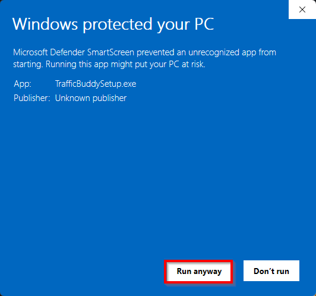
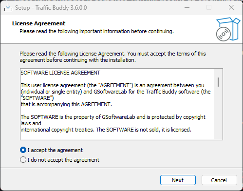
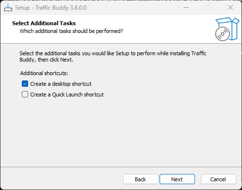
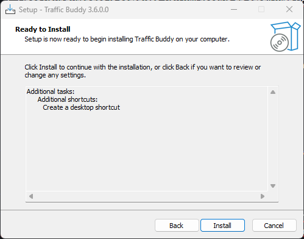
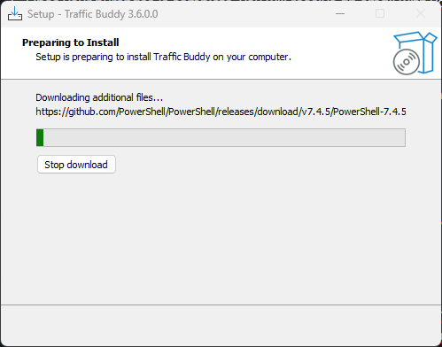
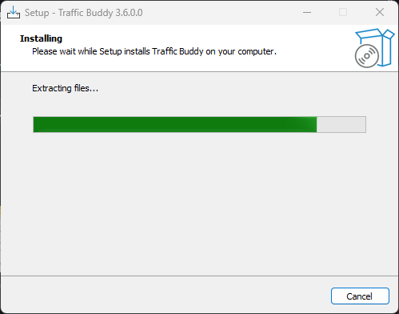
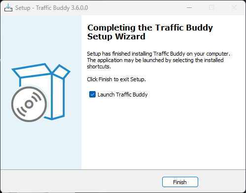
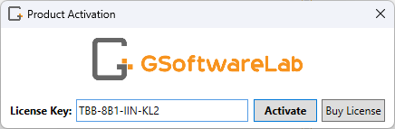

# Getting Started

## Purchase

1. Go to our [online shop](https://gsoftwarelab.com/shop/) and add the product to your cart.
2. Check out and complete your purchase. Your order will be processed instantly.
3. Once your purchase is complete, you will receive an email with your license key and a download link.

## Installation

You can download Traffic Buddy by clicking the link in your order confirmation or using the download button in your [customer area](https://gsoftwarelab.com/my-account/downloads/).

To install Traffic Buddy, follow these steps:

<figure><figcaption></figcaption></figure>

<figure><figcaption></figcaption></figure>

<figure><figcaption></figcaption></figure>

<figure><figcaption></figcaption></figure>

<figure><figcaption></figcaption></figure>

<figure><figcaption></figcaption></figure>

<figure><figcaption></figcaption></figure>

Once the installation is complete, you can proceed with launching Traffic Buddy and follow the license activation steps below.

## License Activation

Upon receiving your order confirmation email, you will find your license key included. This key must be entered when you first start the application. We recommend saving a copy of your license key either by writing it down or printing the email for future reference.

<figure><figcaption>
License activation
</figcaption></figure>

To prevent typos consider copy and pasting the license key from the order confirmation email. After pasting it make sure there is no white space in the beginning or at the end of your entered license key. If you have problems activating your product please feel free to contact our support team.

Remember to keep your license key safe, as it will be needed for future activation or updates. If you'd like, you can write it down or print out the order confirmation email for easy reference.&#x20;

Thank you for choosing our product, and we hope it helps you achieve your goals.
