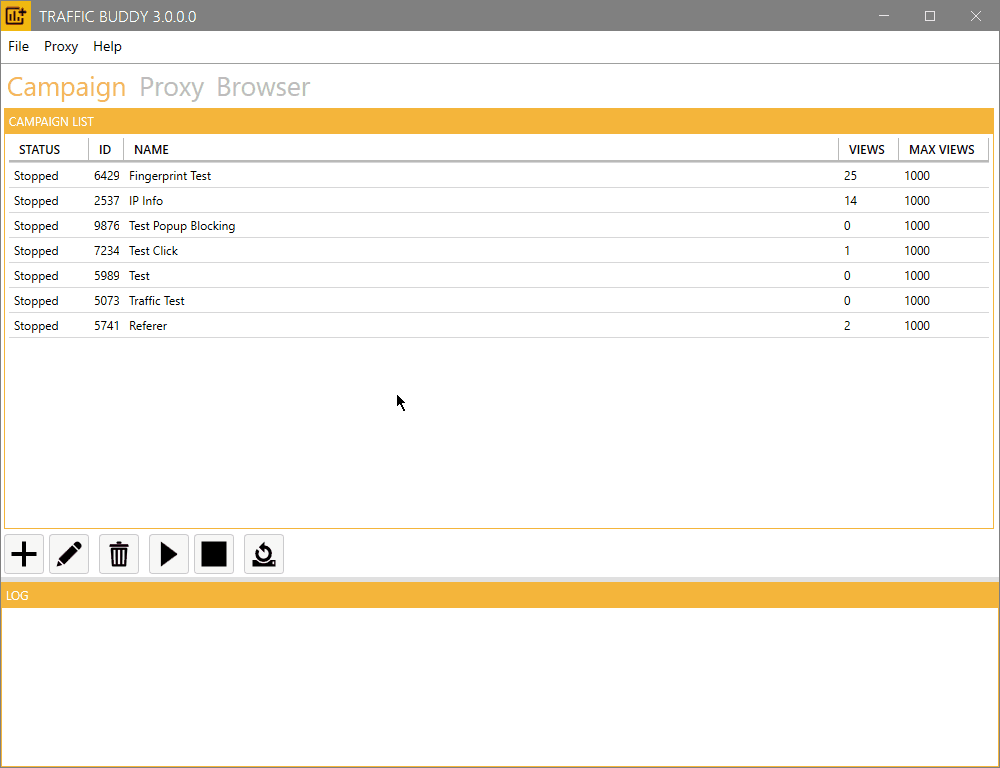
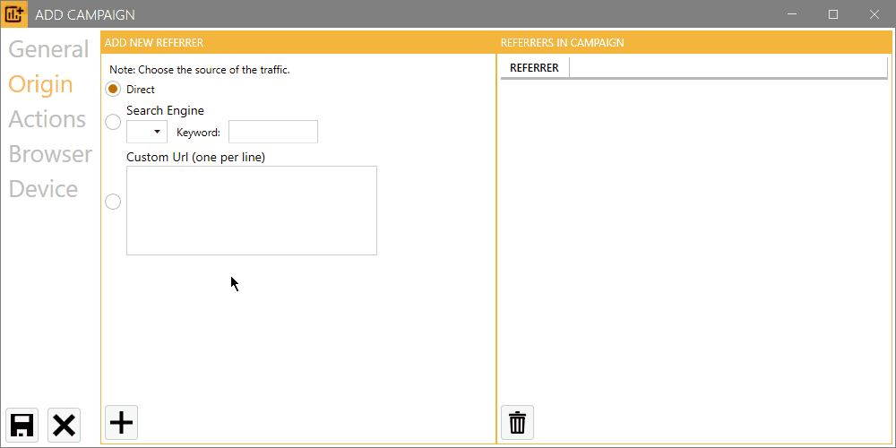
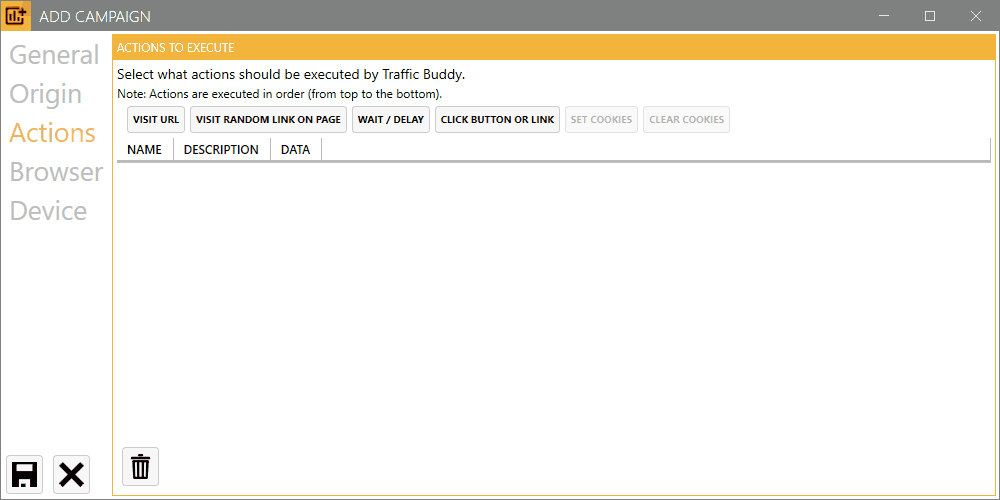
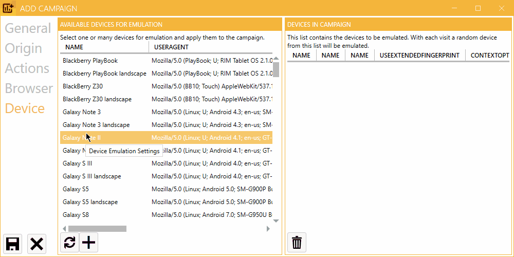

# 📖 Software Guide

Welcome to the Traffic Buddy User Manual, your comprehensive guide to mastering our platform's versatile features. Here, you'll discover how to manage campaigns, leverage custom JavaScript plugins for interactive web interactions, and adjust browser and proxy settings for optimized browsing experiences.

Learn how to add campaigns, customize viewing metrics, and automate user behavior. Harness the power of plugins to interact with specific websites and set up advanced proxy settings for secure browsing. With Traffic Buddy, managing multiple Chromium-based browsers or configuring your traffic's origin is just a click away.

This manual will serve as your go-to resource, whether you're a new user or a seasoned veteran, on your journey towards creating powerful and automated browsing experiences with Traffic Buddy.

## Quick Start Guide for Traffic Buddy

Welcome to the **Quick Start Guide** for Traffic Buddy! This guide will walk you through the essential steps to set up and start your first campaign efficiently.


Unlocking Traffic Buddy: Your Ultimate Guide to Generating Organic Traffic


## Campaigns

<figure><figcaption>
Campaign Overview
</figcaption></figure>

In the **Campaign** tab, you will find a comprehensive list of all your campaigns, allowing for easy navigation and management. At the bottom of this section, the current status of ongoing actions is displayed in real time, giving you instant feedback on your campaigns’ performance.

Traffic Buddy features a **user-friendly interface** with intuitive buttons located below the campaign list. These buttons enable you to manage your campaigns efficiently, offering functionalities such as:

<table data-view="cards"><thead><tr><th>Button</th><th>Description</th></tr></thead><tbody><tr><td></td><td><strong>Add Campaign</strong>: Quickly create new campaigns tailored to your needs.</td></tr><tr><td></td><td><strong>Edit Campaign</strong>: Modify existing campaigns to optimize performance.</td></tr><tr><td></td><td><strong>Remove Campaign</strong>: Delete campaigns that are no longer needed.</td></tr><tr><td></td><td><strong>Start Campaign</strong>: Launch your campaigns with a single click.</td></tr><tr><td></td><td><strong>Stop Campaign</strong>: Pause campaigns whenever necessary.</td></tr><tr><td></td><td><strong>Reset View Count</strong>: Reset campaigns to view count.</td></tr></tbody></table>

### Add a new Campaign

Traffic Buddy allows you to create customized traffic campaigns to generate realistic visitor behavior for your website . Here's a detailed guide on how to set up a new campaign using the different configuration tabs.

<figure><figcaption>
Press the "+" button to add a new traffic campaign
</figcaption></figure>

#### General Settings Tab

<figure><figcaption>
Add a new Campaign: General Settings
</figcaption></figure>

The General Settings tab contains the basic configuration options for your traffic campaign. Here you'll define the campaign's core parameters that determine its identity and scale.

**Campaign ID**

* An automatically generated unique identifier for your campaign
* Read-only field
* Used for tracking and referencing your campaign within Traffic Buddy

**Campaign Name**

* Enter a descriptive name for your campaign
* This name helps you identify your campaign in the campaign list
* Example: "Summer Sale Landing Page Traffic" or "Product Page Testing"
* Must be unique within your Traffic Buddy campaigns

**Maximum Concurrent Browsers**

* Defines how many browser instances can run simultaneously
* Each browser instance simulates one unique visitor
* Valid range: 1 to 1000 browsers
* Higher numbers generate more concurrent traffic but require more system resources
* Recommended: Start with a lower number and increase gradually based on your system's performance

**Maximum Number of Website Views**

* Sets the total number of page views the campaign will generate
* Campaign stops automatically when this number is reached
* Example: Setting this to 1000 means the campaign will stop after generating 1000 page views

📝 **Note:** Consider your system resources when setting concurrent browsers and maximum views. Higher numbers may require more powerful hardware.&#x20;

⚠️ **Important:** Changes to these settings cannot be made while the campaign is running. Stop the campaign first to modify these parameters.

#### Traffic Origin Tab

<figure><figcaption>
Traffic Origin Configuration - Define how visitors reach your website
</figcaption></figure>

The Traffic Origin Tab allows you to configure how visitors appear to arrive at your website. You can simulate different traffic sources that reflect realistic user behavior patterns.

You can configure multiple referrer sources that Traffic Buddy will cycle through during the campaign.

**1. Direct Traffic**

* Simulates visitors who type your URL directly into their browser
* No referrer information is sent
* Represents users who have bookmarked your site or received the link through messaging apps
* Toggle: Enable/Disable direct traffic

**2. Search Engine Traffic**

* Simulates visitors coming from search engine results
* Includes the search keyword in the referrer data
* Configuration fields:
  * Search Engine (e.g., Google, Bing)
  * Search Keyword(s)
* Example: A visitor searching "best running shoes" on Google

**3. Custom URL Referrers**

* Simulates visitors coming from specific websites
* Enter one URL per line
* Format: `https://www.example.com`
* Useful for simulating:
  * Social media traffic
  * Partner website referrals
  * Blog post references

**Managing Multiple Referrers**

* Add as many referrers as needed using the "Add Referrer" button
* Traffic Buddy will cycle through all enabled referrers sequentially
* Each new simulated visitor will use the next referrer in the cycle
* Use drag-and-drop to prioritize referrer order

📝 **Note:** At least one traffic source must be configured for the campaign to start.

⚠️ **Important:** Ensure your custom URLs are properly formatted and accessible to avoid campaign errors.&#x20;

💡 **Tip:** Mix different referrer types to create more realistic traffic patterns.

#### Browser Actions Tab

<figure><figcaption>
Browser Actions Tab - Create your visitor's journey step by step
</figcaption></figure>

In this tab, you configure the sequence of actions that each simulated visitor will perform. Actions are executed in order from top to bottom, creating realistic user behavior patterns.

**⭐ 1. Primary Action: Visit URL**

**\[REQUIRED]** This is the fundamental action that must be included in your campaign.

* Initiates the primary navigation to your target website
* Must be the first action in your sequence
* Without this action, the browser cannot reach your target URL
* Format: `https://www.yourwebsite.com`

2. **Wait / Delay**

* Simulates a user spending time on a page
* Configuration:
  * Duration: Set time in seconds
  * Random variation: Optional +/- seconds for natural behavior
* Example: Wait 30 seconds (±5 seconds) to simulate reading content

**3. Visit Random Link**

* Automatically finds and clicks a random link on the current page
* Configuration:
  * Wait time: How long to stay on the resulting page
  * Optional: Link pattern filtering
* Simulates natural website exploration

**4. Click Element**

* Performs targeted clicks on specific page elements
* Configuration:
  * Selector type: CSS or JavaScript
  * Element selector: Enter the specific selector
  * Wait time after click
* Example selectors:
  * CSS: `#submit-button` or `.nav-link`
  * JavaScript:`.class-name`

📝 **Note:** Always start with the Visit URL action as your first step.&#x20;

⚠️ **Important:** Actions are executed sequentially. Ensure proper wait times between actions for realistic behavior.&#x20;

💡 **Tip:** Combine different actions to create natural-looking user journeys through your website.

#### Browser Settings Tab

<figure><figcaption>
Browser Settings Configuration - Control core browser behavior and performance options
</figcaption></figure>

The Browser Settings Tab contains essential configuration options that control how the browser instances behave during your traffic campaign.

**Hide Browser Windows**

* Toggle ON/OFF (Enabled by default)
* When enabled: Browsers run in the background without visible windows
* When disabled: Browser windows are visible on screen
* Use cases for disabling:
  * Debugging campaign behavior
  * Monitoring visitor actions in real-time
  * Testing new action sequences

**Use Proxy Servers**

* Toggle ON/OFF
* When enabled: Traffic is routed through proxy servers
* Helps distribute traffic across different IP addresses
* Useful for:
  * Avoiding IP-based rate limiting
  * Creating more realistic traffic patterns
  * Testing geo-specific content
* ⚠️When enabled proxy servers need to be configured (see Proxy Settings)

**Browser Timeout**

* Specifies maximum time (in seconds) for browser operations
* Default: 120 seconds
* Applies to:
  * Page loading
  * Navigation between pages
* If timeout is reached, browser instance continues with next action

📝 **Note:** Lower timeout values may cause premature action termination on slower websites or with slow proxy servers.&#x20;

⚠️ **Important:** When running many concurrent browsers, keeping the "Hide Browser Windows" option enabled is recommended for better performance.&#x20;

💡 **Tip:** Start with default settings and adjust based on your specific needs and system capabilities.

#### Device Emulation Tab

<figure><figcaption>
Device Profile Manager - Configure your virtual visitor devices
</figcaption></figure>

The Device Emulation Tab allows you to configure which devices your simulated visitors will use. Traffic Buddy will rotate through your selected devices to create diverse and realistic visitor profiles.

**Interface Layout**

* **Left Panel:** Available Devices List
* **Right Panel:** Devices in Campaign List
* **Center:** Add ("+") and Remove ("-") buttons

**Available Devices List**

Browse through a comprehensive collection of devices including:

* Mobile Devices
  * iPhones (various models)
  * Android phones
  * Tablets
* Desktop Systems
  * Windows PCs
  * Mac computers
  * Linux workstations
* Different Browser Configurations
  * Chrome
  * Firefox
  * Safari
  * Edge

**Managing Campaign Devices**

1. **Adding Devices**
   * Select a device from the Available Devices List
   * Click the "+" button to add it to your campaign
   * Added devices appear in the Devices in Campaign List
2. **Removing Devices**
   * Select a device from the Devices in Campaign List
   * Click the "-" button to remove it from your campaign
3. **Device Rotation**
   * Traffic Buddy automatically rotates through selected devices
   * Each new visitor is assigned the next device in the rotation
   * Creates diverse traffic patterns

📝 **Note:** At least one device must be selected to start the campaign.&#x20;

💡 **Tip:** Select a variety of devices to create more realistic traffic patterns that match your target audience's device usage.&#x20;

⚠️ **Important:** The more devices you select, the more diverse your traffic will appear in analytics.

## Proxy Settings

<figure><figcaption>
Proxy Settings Configuration - Manage and configure proxy servers for enhanced anonymity
</figcaption></figure>

The Proxy Settings Tab enables you to configure and manage proxy servers for your traffic campaigns, providing control over IP addresses and locations used for website visits.

### Core Features

#### Proxy Server List

* Central display of all configured proxy servers
* Shows proxy details:
  * IP address and port
  * Protocol type (HTTP, HTTPS, SOCKS4, SOCKS5)
  * Country location
  * Current status

#### Adding Proxy Servers

Access through top menu: "Proxy" →

* "Add from file": Import proxy list from text file
* "Add from clipboard": Paste proxy list directly
* Download pre-scraped public proxies (tested and verified)

### Configuration Options

#### **Proxy Control Settings**

* **Test Proxy Server Before Browsing**
  * Toggle ON/OFF
  * Verifies proxy functionality before use
  * Prevents failed connections
* **Disable Down Proxies**
  * Toggle ON/OFF
  * Automatically removes non-responding proxies
  * Maintains clean, functional proxy list
* **Scrape Proxies from File** _(Coming Soon)_
  * Toggle ON/OFF
  * Automatically import proxies from specified file
  * Regular updates of proxy list
* **Tor Proxy Support** _(Coming Soon)_
  * Toggle ON/OFF
  * Enhanced anonymity through Tor network
  * Additional security layer

#### **Country Filtering**

* Filter proxies by country
* Remove proxies from specific countries
* Useful for:
  * Targeting specific geographic locations
  * Avoiding blocked regions
  * Creating location-specific traffic patterns

📝 **Note:** Regular proxy testing and updates are recommended for optimal performance.&#x20;

⚠️ **Important:** Ensure proxy servers comply with target website's terms of service.&#x20;

💡 **Tip:** Use a mix of proxy types and locations for more natural traffic patterns.

### Proxy Recommendations

**Best Practices for Optimal Results**

* **Private Residential Proxies Recommended**
  * Provides highest success rates
  * Most reliable performance
  * Better mimicking of real user behavior
  * Reduced chance of detection

**Why Private Residential Proxies?**

* Exclusive access (not shared with other users)
* Higher success rates for traffic generation
* More stable connections
* Better geographic targeting accuracy
* Reduced risk of IP blacklisting

## Top Menu

<figure><figcaption>
Top Menu
</figcaption></figure>

### **File Menu**

* **Load/Save Campaign**: Quickly save your current campaign settings or load a previously saved campaign for easy access and management.
* **Delete All Campaigns**: Clear all existing campaigns with a single click. Use this option with caution, as it will remove all campaign data permanently.
* **Exit the Application**: Close Traffic Buddy gracefully, ensuring that all settings and changes are saved.

### **Proxy Menu**

* **Import Proxies from Clipboard**: Easily import proxies in various formats (HTTP, HTTPS, SOCKS, and ProxyBuddy/Scrapebox) directly from your clipboard for quick setup.
* **Import Proxies from Text File**: Load proxies from a text file using supported formats (HTTP, HTTPS, SOCKS, and ProxyBuddy/Scrapebox) to streamline your configuration process.
* **Download a List of Pre-Scraped Public Proxies**: Access a curated list of public proxies suitable for scraping tasks, giving you a head start on your projects.
* **Recommendation**: We recommend using **private proxy servers** or **residential proxy servers** for enhanced performance and security.

### **Help Menu**

* **Contact Us**: Reach out for support or inquiries. Our team is here to assist you with any questions or issues you may encounter.
* **Browse the Documentation**: Navigate through comprehensive documentation to find detailed guides, tips, and troubleshooting information.
* **Remove Your License Key from the Software**: Safely remove your license key if needed, ensuring that your software is deactivated before uninstalling or transferring it to another device.
